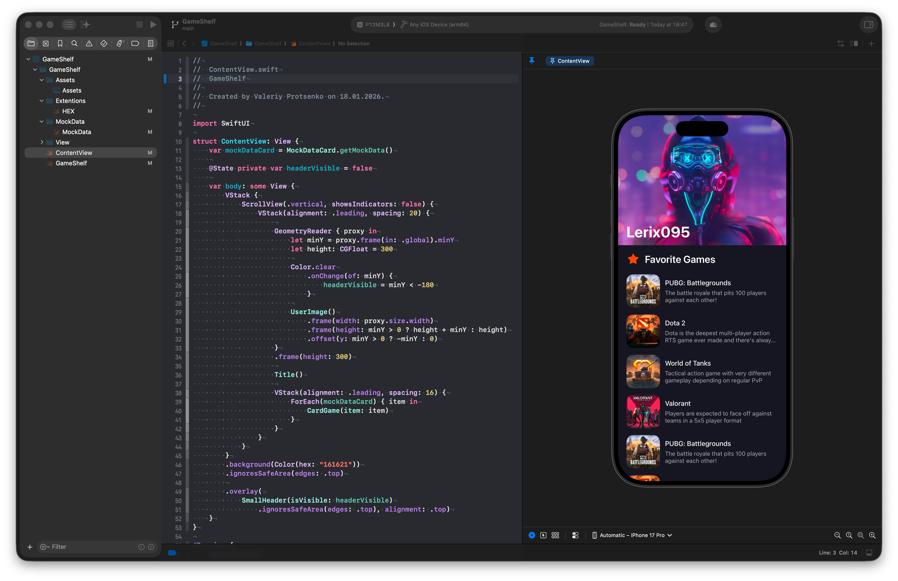

# GameShelf (iOS 26+)

A gaming profile iOS app concept with a parallax hero image, 
dynamic sticky header, and dark UI built with SwiftUI.

## Preview

## Features

- Parallax hero image effect via GeometryReader
- Dynamic sticky header on scroll
- Dark UI with custom color tokens
- Reusable card components
- MVVM architecture with mock data

## Stack

- Swift
- SwiftUI
- GeometryReader
- MVVM
- Mock Data

## Design

Designed in Figma before development.  
[View Figma Mockup →](https://www.figma.com/design/QK961iwJ7mZQV7nwrAF6a7/Pojects?node-id=1-318&t=HKYlJYhcWbectBqt-1)

## Author

Valeriy Protsenko — iOS Design Engineer  
[LinkedIn](https://www.linkedin.com/in/valprotsenko)
[Website](https://lerix.pro/?lang=en)
[Telegram](https://t.me/vallerqq)
